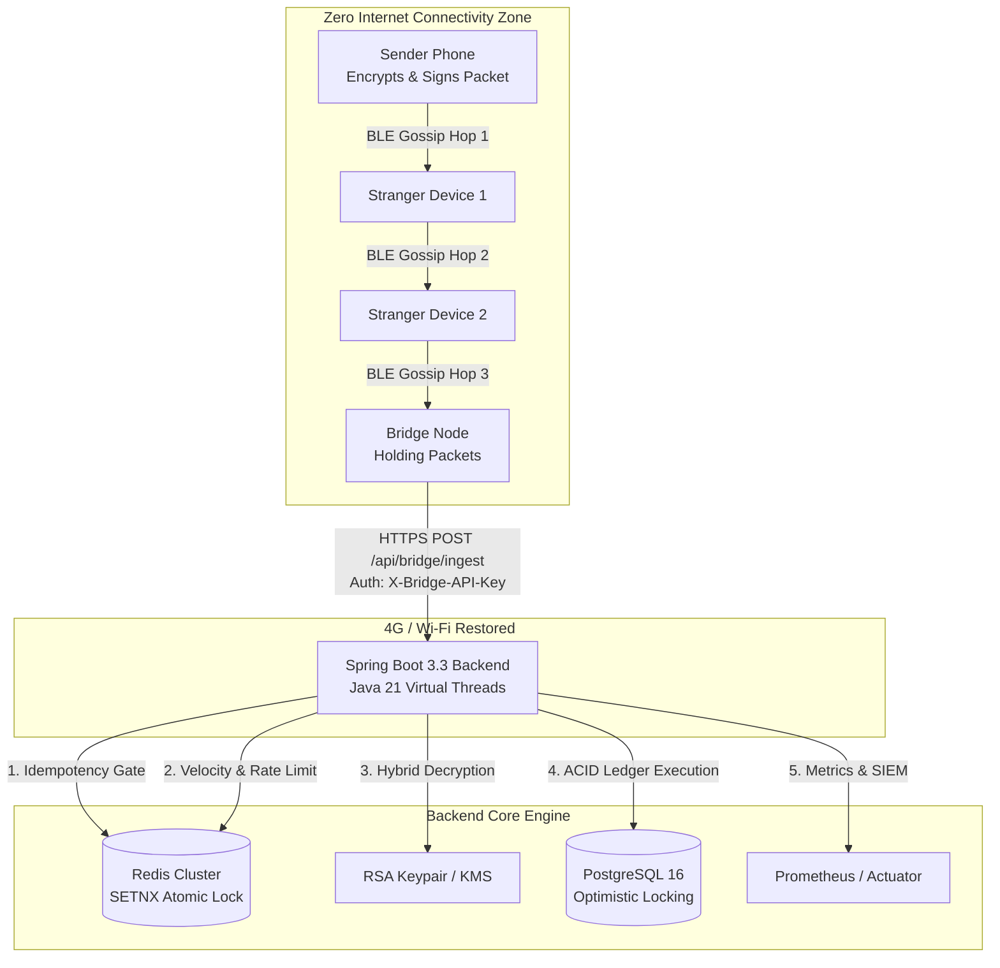

# Mesh-Routed Deferred Settlement (UPI Offline Mesh) 🚀


An enterprise-grade distributed payment infrastructure engineered to enable **offline, peer-to-peer digital transactions** in zero-connectivity environments (such as underground transit, basements, remote terrains, or congested stadiums). 

Leveraging **Hybrid Cryptography (RSA-OAEP + AES-GCM)**, **Distributed Idempotency (Redis SETNX)**, and **Java 21 Virtual Threads**, this system enables transactions to securely hop across offline intermediary devices via Bluetooth Low Energy (BLE) until any device in the mesh reaches internet connectivity and acts as a bridge to flush the encrypted packets to the backend server.

---

## 🌟 Executive Summary & Problem Statement

In standard digital payment architectures (like UPI or instant bank transfers), real-time internet connectivity is mandatory for both authentication and ledger authorization. When connectivity drops, commerce halts.

### The Engineering Challenge
How do you allow User A to send ₹500 to User B without internet access, while guaranteeing:
1. **Zero-Trust Intermediaries:** Packets relayed by stranger devices cannot be read or tampered with.
2. **Exactly-Once Settlement:** If multiple relay devices walk into 4G/Wi-Fi zones simultaneously and upload the exact same payment packet, the system must never double-debit or double-credit.
3. **Double-Spend & Replay Protection:** Malicious actors attempting to broadcast outdated packets or spam offline transactions across distinct physical zones must be intercepted and neutralized.

---

## 🏗️ System Architecture



---

## ⚙️ Core Architectural Pillars

### 1. Hybrid Cryptography (End-to-End Security)
To ensure absolute privacy across untrusted peer hops, every transaction payload (`PaymentInstruction`) is encrypted on the sender device before broadcasting:
* **Session Encryption:** An ephemeral 256-bit AES-GCM session key encrypts the payment details (Sender VPA, Receiver VPA, Amount, Nonce, Timestamp). AES-GCM provides both confidentiality and authentication tags, instantly exposing single-bit tampering attempts.
* **Key Wrapping:** The AES session key is wrapped using the backend server's **RSA-2048 public key** (OAEP padding with SHA-256). Intermediaries only see opaque, unforgeable ciphertexts.

### 2. Distributed Idempotency & Duplicate Storm Defense
When multiple bridge nodes regain internet access simultaneously, they attempt to flush identical mesh packets in parallel.
* The backend computes a SHA-256 digest of the raw wire ciphertext.
* A distributed lock is executed via Redis: `SET upimesh:idempotency:{hash} claimed NX EX 86400`.
* Because `SETNX` is atomic across all backend replicas, exactly one worker thread claims the transaction. All subsequent concurrent requests are terminated with a `DUPLICATE_DROPPED` outcome without touching the database.
* **Fail-Closed Guarantee:** If the Redis cluster experiences network partitions or outages, the system fails closed (returning HTTP 503 Service Unavailable), prioritizing ledger integrity over availability.

### 3. Velocity Checking & Offline Spike Protection
To mitigate offline double-spending attacks where a compromised device attempts to broadcast rapid transactions across separate offline clusters:
* The ingestion pipeline maintains a real-time sliding window velocity counter in Redis (`upimesh:velocity:{senderVpa}`).
* If a sender exceeds configurable threshold parameters (`MAX_PACKETS_PER_WINDOW`), incoming packets are instantly flagged and rejected with `VELOCITY_EXCEEDED`.

### 4. High-Concurrency Execution (Project Loom)
Built natively on **Java 21 Virtual Threads**, the web server scales dynamically to handle massive spikes in simultaneous bridge ingestion connections without exhausting OS kernel threads or thread-pool memory.

---

## 🛠️ Technology Stack

| Component | Technology | Description |
| :--- | :--- | :--- |
| **Language & Runtime** | Java 21 LTS | Leveraging Virtual Threads (Loom) for high-throughput I/O |
| **Framework** | Spring Boot 3.3.5 | Core DI, REST APIs, Security, Scheduling, and Actuator |
| **Persistence Layer** | PostgreSQL 16 + Spring Data JPA | ACID database with `@Version` optimistic locking |
| **Distributed Cache** | Redis 7.0 | Atomic deduplication (`SETNX`) and velocity rate limiting |
| **Schema Management** | Flyway | Automated, version-controlled database migrations |
| **Security & Auth** | Spring Security 6 | Custom `BridgeApiKeyFilter` for token-based API authentication |
| **Observability** | Micrometer + Prometheus | Real-time SIEM counter metrics and Actuator health checks |
| **Infrastructure** | Docker & Docker Compose | Multi-stage container builds with Docker Secrets (`_FILE`) |

---

## 🚀 Getting Started & Deployment

### Prerequisites
* Java 21 JDK (if running locally without Docker)
* Docker & Docker Compose (for production container stack)
* Maven 3.9+ (or included `./mvnw` wrapper)

### Option 1: Production Deployment (Docker Compose)
The recommended deployment method spins up the isolated Spring Boot application, PostgreSQL database, and Redis cache container stack.

```bash
# Clone repository and boot full production mesh
docker compose up --build -d
```
* The application initializes database schemas via Flyway (`V1__init_schema.sql`).
* API endpoints become accessible at `http://localhost:8080`.
* Prometheus metrics exposed at `http://localhost:8080/actuator/prometheus`.

### Option 2: Local Development Profile (`dev`)
For rapid local iteration, the `dev` profile operates entirely in-memory with zero external infrastructure dependencies (H2 database + JVM `ConcurrentHashMap` fallback).

```bash
./mvnw spring-boot:run -Dspring-boot.run.profiles=dev
```
Open **http://localhost:8080** in your browser to access the interactive simulation dashboard!

---

## 🔒 Configuration & Secret Management

The system natively supports **Docker Secrets** and enterprise KMS patterns via environment variable resolution. Any property ending in `_FILE` automatically resolves its value from the specified filesystem path on startup.

| Environment Variable | Default Value | Description |
| :--- | :--- | :--- |
| `SPRING_PROFILES_ACTIVE` | `dev` | Profile mode (`dev` or `prod`) |
| `SPRING_DATASOURCE_URL` | `jdbc:postgresql://localhost:5432/upimesh` | PostgreSQL JDBC connection URL |
| `SPRING_DATASOURCE_PASSWORD_FILE` | *(none)* | Docker secret file path for DB password |
| `BRIDGE_API_KEYS` | `dev-bridge-secret-key-12345` | Comma-separated allowed bridge API keys |
| `RSA_PRIVATE_KEY_FILE` | *(none)* | Path to PKCS#8 DER private key secret file |
| `upi.mesh.rsa.enforce-provisioned` | `false` (`true` in prod) | Prevents startup if RSA keys are not injected |

---

## 📡 API Reference & Verification

### 1. Ingest Mesh Packet (Production Bridge Endpoint)
```http
POST /api/bridge/ingest HTTP/1.1
Host: localhost:8080
Content-Type: application/json
X-Bridge-API-Key: dev-bridge-secret-key-12345
X-Bridge-Node-Id: bridge-node-alpha
X-Hop-Count: 3

{
  "packetId": "d3b07384-d113-4c4e-9c81-cc19760777e5",
  "ttl": 2,
  "createdAt": 1730000000000,
  "ciphertext": "BASE64_ENCRYPTED_PAYLOAD_STRING..."
}
```

**Success Response (200 OK):**
```json
{
  "outcome": "SETTLED",
  "packetHash": "e3b0c44298fc1c149afbf4c8996fb92427ae41e4649b934ca495991b7852b855",
  "reason": null,
  "transactionId": 101
}
```

### 2. Check Observability Metrics
```bash
curl http://localhost:8080/actuator/metrics/bridge.ingest
```

---

## 🧪 Automated Testing Suite

The project includes an exhaustive integration test suite covering high-concurrency race conditions, cryptographic tampering, and Redis network failures.

```bash
./mvnw test
```

Key test scenarios verified:
* `singlePacketDeliveredByThreeBridgesSettlesExactlyOnce`: Spawns parallel thread pools firing identical packets simultaneously to verify atomic Redis deduplication.
* `tamperedCiphertextIsRejected`: Flips payload bits to verify AES-GCM auth tag verification failures.
* `velocityThresholdExceededReturnsInvalid`: Validates per-sender sliding window rate limiters.
* `redisUnavailabilityFailsClosed`: Simulates Redis connection timeouts confirming HTTP 503 fail-closed safety.

---

## 👨‍💻 Author
Built and engineered as a scalable, high-concurrency distributed backend system demonstrating modern cloud-native Java 21 practices and resilience patterns.
